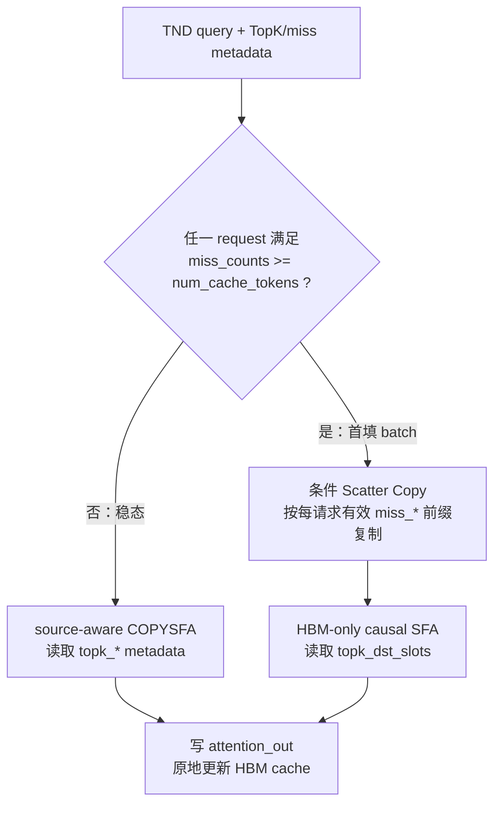

> Imported from private `xwLearnsLLM/nanovllm-DSA-offload`, commit `1518a90dd17592dc3aa96c16869cfde597a250b4`. The first-fill copy is included as `FirstFillScatterCopy`. The attention sources and tiling helpers are private to this operator, preserving the existing MTP0 implementation. The adapter uses the existing queue-safe `EXEC_NPU_CMD_ORDERED` allocator; upstream environment-controlled workspace reuse is not imported.

# COPYSFA-MTP 单算子调优工程

这是 GLM `fused_copy_sfa_mtp` 的独立调优工程，不包含 nanovllm 推理框架，也不依赖 `nanovllm-DSA-offload-mtp` 的源码或编译产物。算子接口支持动态 TND 分段和每请求不同的 MTP 路数（能力上限 MTP15）；`scatter_copy` 和 `sparse_tail_attention_mtp` 作为 split 性能与精度基线保留。

## 接口与运行语义

```python
torch.ops._C_ascend.npu_fused_copy_sfa_mtp(
    query_rope, query, actual_seq_lengths_query, actual_seq_lengths_kv,
    num_cache_tokens, topk_dst_slots, topk_src_ids, topk_miss_counts,
    miss_src_ids, miss_dst_slots, miss_counts, hbm_block_table,
    dram_block_table, hbm_k_rope, hbm_kv_cache, dram_k_rope,
    dram_kv_cache, scale_value, attention_out,
) -> None
```

| 参数 | shape / 类型 | 访问 | 含义 |
|---|---|---|---|
| `query_rope` / `query` | bf16/fp16 `[T,N,64]` / `[T,N,512]` | 只读 | TND 格式的 MTP query。 |
| `actual_seq_lengths_query` | int32 `[B]` | 只读 | 每请求 query 行数的前缀和；最后一项为 `T`。 |
| `actual_seq_lengths_kv` | int32 `[B]` | 只读 | 每请求最后一路 query 的 HBM 逻辑 KV 长度。 |
| `num_cache_tokens` | int32 `[B]` | 只读 | 每请求 HBM 稀疏缓存预算 `C`。 |
| `topk_dst_slots` / `topk_src_ids` | int32 `[T,1,2048]` | 只读 | 每路 TopK 的 HBM slot / 完整 source ID；source ID 为 miss 前缀、hit 后缀。 |
| `topk_miss_counts` | int32 `[T]` | 只读 | 每路 TopK miss 前缀长度。 |
| `miss_src_ids` / `miss_dst_slots` | int32 `[B,32768]` | 只读 | request 级 copy 清单；仅前 `miss_counts[b]` 项有效。 |
| `miss_counts` | int32 `[B]` | 只读 | request 级 copy 数，也是首次填充判定依据。 |
| `hbm_block_table` / `dram_block_table` | int32 `[B,max_blocks]` | 只读 | 逻辑块到物理块的映射。 |
| `hbm_k_rope` / `hbm_kv_cache` | bf16/fp16 `[blocks,128,1,64]` / `[blocks,128,1,512]` | 读写 | Attention 输入及 copy destination。 |
| `dram_k_rope` / `dram_kv_cache` | bf16/fp16 `[blocks,128,64]` / `[blocks,128,512]` | 只读 | copy source。 |
| `scale_value` / `attention_out` | float / bf16/fp16 `[T,N,512]` | 只读 / 只写 | Attention scale 与输出。 |

所有 tensor 必须连续并位于同一 NPU；浮点 tensor 必须同为 BF16 或 FP16。`N` 支持
8/16/32/64/128；每请求 query 行数为 1..16，对应 MTP0..MTP15。`miss_*` 宽度 32768 等于
`16 × 2048`，覆盖 MTP15 最坏无重合 miss union。

对请求 `b`，令 `start = b==0 ? 0 : actual_seq_lengths_query[b-1]`、
`Q = actual_seq_lengths_query[b]-start`。其第 `r` 路 query 使用全局行 `start+r`，
并只可见：

```text
visible_kv_len(b, r) = actual_seq_lengths_kv[b] - (Q - 1 - r)
```



- 稳态 batch 使用融合路径，`miss_src_ids/miss_dst_slots` 不参与搬移。
- 任一 request 首填时，整个 batch 使用 copy + HBM-only SFA；条件 copy 仍按每个
  request 的 `miss_counts` 消费各自的有效 `miss_*` 前缀。
- 路径选择和条件 copy 均在同一 NPU stream 上完成，不依赖 CPU 回读或 Python 分支，
  可用于 Graph capture/replay。
